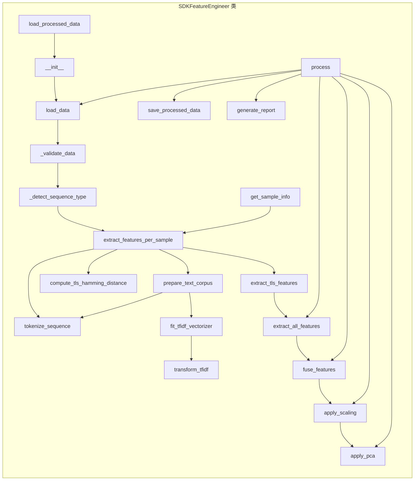
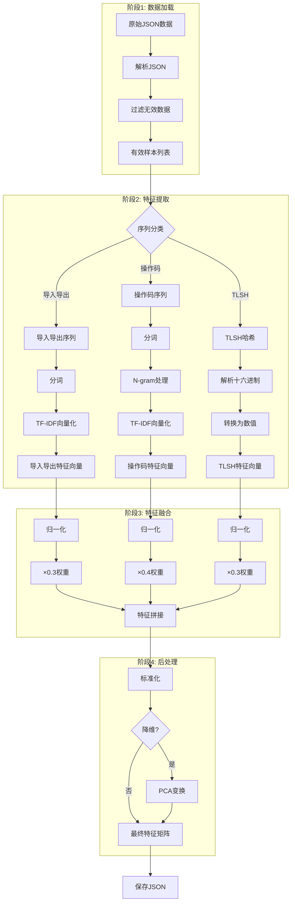
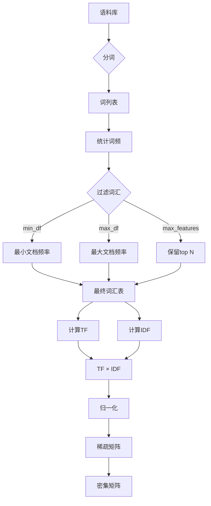
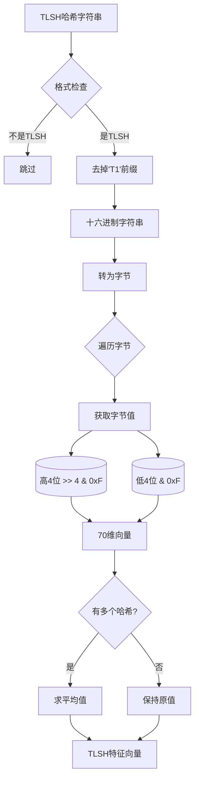

# SDK特征工程流程图

## 完整流程图 (Mermaid)

```mermaid
graph TD
    Start([开始]) --> LoadData[加载数据<br/>load_data]
    
    LoadData --> CheckFormat{文件格式?}
    
    CheckFormat -->|JSONL| ReadJSONL[逐行读取<br/>json.loads]
    CheckFormat -->|JSON数组| ReadArray[解析数组<br/>json.loads]
    CheckFormat -->|单个JSON| ReadSingle[解析单个对象<br/>json.loads]
    CheckFormat -->|其他| Error1[抛出异常<br/>ValueError]
    
    ReadJSONL --> ValidateData
    ReadArray --> ValidateData
    ReadSingle --> ValidateData
    
    ValidateData[验证数据<br/>_validate_data]
    ValidateData --> CheckFields{字段完整?}
    CheckFields -->|否| Skip1[跳过样本]
    CheckFields -->|是| CheckHashes{哈希非空?}
    CheckHashes -->|否| Skip1
    CheckHashes -->|是| StoreData[存储有效数据]
    
    Skip1 --> NextSample{还有样本?}
    NextSample -->|是| ValidateData
    NextSample -->|否| ExtractAll[提取所有特征<br/>extract_all_features]
    
    StoreData --> NextSample
    
    ExtractAll --> ExtractImport[导入导出特征]
    ExtractAll --> ExtractOpcode[操作码特征]
    ExtractAll --> ExtractTLSH[TLSH特征]
    
    ExtractImport --> PrepImport[准备语料库<br/>prepare_text_corpus]
    PrepImport --> TokenizeImport[分词处理<br/>tokenize_sequence]
    TokenizeImport --> FitImport[训练TF-IDF<br/>fit_tfidf_vectorizer]
    FitImport --> TransformImport[转换特征<br/>transform_tfidf]
    
    ExtractOpcode --> PrepOpcode[准备语料库]
    PrepOpcode --> TokenizeOpcode[分词处理]
    TokenizeOpcode --> FitOpcode[训练TF-IDF]
    FitOpcode --> TransformOpcode[转换特征]
    
    ExtractTLSH --> ParseTLSH[解析TLSH哈希<br/>extract_tls_features]
    ParseTLSH --> HexToBytes[十六进制转字节<br/>bytes.fromhex]
    HexToBytes --> SplitBytes[字节拆分4位<br/>高4位/低4位]
    SplitBytes --> Vector70[生成70维向量]
    
    TransformImport --> FuseFeatures[融合特征<br/>fuse_features]
    TransformOpcode --> FuseFeatures
    Vector70 --> FuseFeatures
    
    FuseFeatures --> Normalize[归一化<br/>MinMaxScaler]
    Normalize --> ApplyWeight[应用权重<br/>import:0.3<br/>opcode:0.4<br/>tls:0.3]
    ApplyWeight --> Concatenate[拼接特征<br/>np.hstack]
    
    Concatenate --> Scale[标准化<br/>apply_scaling]
    Scale --> CheckScaler{标准化方式?}
    CheckScaler -->|standard| StandardScaler[Z-score标准化]
    CheckScaler -->|minmax| MinMaxScaler[Min-Max归一化]
    CheckScaler -->|其他| SkipScale[跳过标准化]
    
    StandardScaler --> CheckPCA
    MinMaxScaler --> CheckPCA
    SkipScale --> CheckPCA
    
    CheckPCA{配置PCA?}
    CheckPCA -->|是| ApplyPCA[PCA降维<br/>apply_pca]
    CheckPCA -->|否| FinalMatrix[最终特征矩阵]
    
    ApplyPCA --> FinalMatrix
    
    FinalMatrix --> SaveData[保存数据<br/>save_processed_data]
    SaveData --> WriteJSON[写入JSON文件]
    WriteJSON --> GenerateReport[生成报告<br/>generate_report]
    GenerateReport --> Statistics[统计信息<br/>样本数/特征覆盖率]
    Statistics --> End([结束])
    
    Error1 --> End
    
    style Start fill:#90EE90
    style End fill:#FFB6C1
    style FinalMatrix fill:#87CEEB
    style FuseFeatures fill:#DDA0DD
    style ExtractImport fill:#FFD700
    style ExtractOpcode fill:#FFA500
    style ExtractTLSH fill:#FF6347
```



---

## 类方法调用关系图



---

## 数据处理流程详解



---

## TF-IDF向量化流程



---

## TLSH哈希处理流程



---

## 特征融合流程

```mermaid
graph LR
    subgraph "输入特征"
        I1[导入导出<br/>n×4]
        I2[操作码<br/>n×192]
        I3[TLSH<br/>n×70]
    end
    
    subgraph "归一化"
        N1[MinMaxScaler<br/>[0,1]]
        N2[MinMaxScaler<br/>[0,1]]
        N3[MinMaxScaler<br/>[0,1]]
    end
    
    subgraph "加权"
        W1[×0.3]
        W2[×0.4]
        W3[×0.3]
    end
    
    subgraph "拼接"
        C[特征矩阵<br/>n×266]
    end
    
    I1 --> N1 --> W1
    I2 --> N2 --> W2
    I3 --> N3 --> W3
    
    W1 --> C
    W2 --> C
    W3 --> C
```

---

## 标准化与PCA流程

```mermaid
graph TD
    Fused[融合特征<br/>n×266] --> ScaleMethod{标准化方式?}
    
    ScaleMethod -->|StandardScaler| Standard[(x-μ)/σ]
    ScaleMethod -->|MinMaxScaler| MinMax[(x-min)/(max-min)]
    ScaleMethod -->|无| Bypass[保持原值]
    
    Standard --> Scaled[标准化特征]
    MinMax --> Scaled
    Bypass --> Scaled
    
    Scaled --> CheckPCA{配置PCA?}
    
    CheckPCA -->|否| Final[最终特征<br/>n×266]
    CheckPCA -->|是| FitPCA[训练PCA]
    
    FitPCA --> TransformPCA[变换特征]
    TransformPCA --> Reduced[降维特征<br/>n×k]
    
    Reduced --> Final
```

---

## 完整调用链

```
main()
  └─ SDKFeatureEngineer()
        └─ process(data_path)
              ├─ load_data(data_path)
              │     └─ _validate_data(data)
              │
              └─ extract_all_features()
                    ├─ prepare_text_corpus('import_export_sequences')
                    │     └─ extract_features_per_sample()
                    │           └─ _detect_sequence_type()
                    │                 └─ tokenize_sequence()
                    │
                    ├─ fit_tfidf_vectorizer()
                    ├─ transform_tfidf()
                    │
                    ├─ prepare_text_corpus('opcode_sequences')
                    │     └─ extract_features_per_sample()
                    │           └─ _detect_sequence_type()
                    │                 └─ tokenize_sequence()
                    │
                    ├─ fit_tfidf_vectorizer()
                    ├─ transform_tfidf()
                    │
                    └─ extract_tls_features()
                          └─ extract_features_per_sample()
                                └─ _detect_sequence_type()
              
              └─ fuse_features(features_dict)
                    └─ apply_scaling(features)
                          └─ apply_pca(features)
              
              ├─ save_processed_data(output_path)
              │     └─ get_sample_info(idx)
              │           └─ extract_features_per_sample()
              │
              └─ generate_report()
                    └─ extract_features_per_sample()
```

---

## 数据流转示例

```
样本数据 (1个SDK)
┌─────────────────────────────────────────┐
│ coordinateName: "@abner/log"         │
│ version: "1.0.3"                  │
│ codeTlshHashes: [                  │
│   "@:hilog hilog Log",     → 导入导出
│   "nop stricteq add2...",    → 操作码
│   "T1A521981D0779E0E...",  → TLSH
│   ...                              │
│ ]                                  │
└─────────────────────────────────────────┘
           ↓
    ┌─────────────────────────────┐
    │   特征提取阶段           │
    └─────────────────────────────┘
           ↓
导入导出: TF-IDF → [0.5, 0.3, 0.0, 0.5]     (4维)
操作码:   TF-IDF → [0.1, 0.0, 0.8, ...]      (192维)
TLSH:     解析   → [0.3, 0.2, 0.5, ...]        (70维)
           ↓
    ┌─────────────────────────────┐
    │   特征融合阶段           │
    └─────────────────────────────┘
           ↓
归一化 + 加权:
  导入导出 × 0.3 → [0.15, 0.09, 0.0, 0.15]
  操作码   × 0.4 → [0.04, 0.0, 0.32, ...]
  TLSH     × 0.3 → [0.09, 0.06, 0.15, ...]
           ↓
拼接: [0.15, 0.09, 0.0, 0.15, 0.04, 0.0, 0.32, ..., 0.09, 0.06, 0.15, ...]
      ↑  4维导入导出     ↑ 192维操作码       ↑ 70维TLSH
      总计: 266维
           ↓
    ┌─────────────────────────────┐
    │   后处理阶段             │
    └─────────────────────────────┘
           ↓
标准化: Z-score → [-0.5, 1.2, -1.0, 0.8, ...]
           ↓
PCA: (可选) → [0.1, -0.5, 0.8, ...]  (降维到k维)
           ↓
最终特征矩阵: shape (1, 266) 或 (1, k)
           ↓
保存到: processed_features.json
```

---

## 关键决策点

| 决策点 | 判断条件 | 分支 |
|--------|---------|------|
| 文件格式 | 后缀名 | .jsonl / .json(数组) / .json(单个) |
| 数据验证 | 字段完整 + 哈希非空 | 保留 / 跳过 |
| 序列类型 | T1开头且长度70 / 包含冒号 / 包含指令 | TLSH / 导入导出 / 操作码 |
| 词汇过滤 | min_df / max_df / max_features | 保留 / 过滤 |
| 标准化方式 | 配置参数 | standard / minmax / 跳过 |
| PCA降维 | 配置pca_components | 执行 / 跳过 |

---

## 输出文件结构

```
processed_features.json
├── feature_matrix      # 特征矩阵 (n×266)
├── sample_info        # 样本信息列表
│   ├── coordinateName
│   ├── version
│   ├── import_export_count
│   ├── opcode_count
│   ├── tlsh_count
│   └── total_sequences
├── config            # 配置参数
│   ├── max_features
│   ├── ngram_range
│   ├── min_df
│   ├── max_df
│   ├── pca_components
│   ├── scaler
│   ├── tlsh_weight
│   ├── opcode_weight
│   └── import_weight
└── feature_shapes    # 特征维度
    ├── import_export
    ├── opcode
    └── tlsh
```
